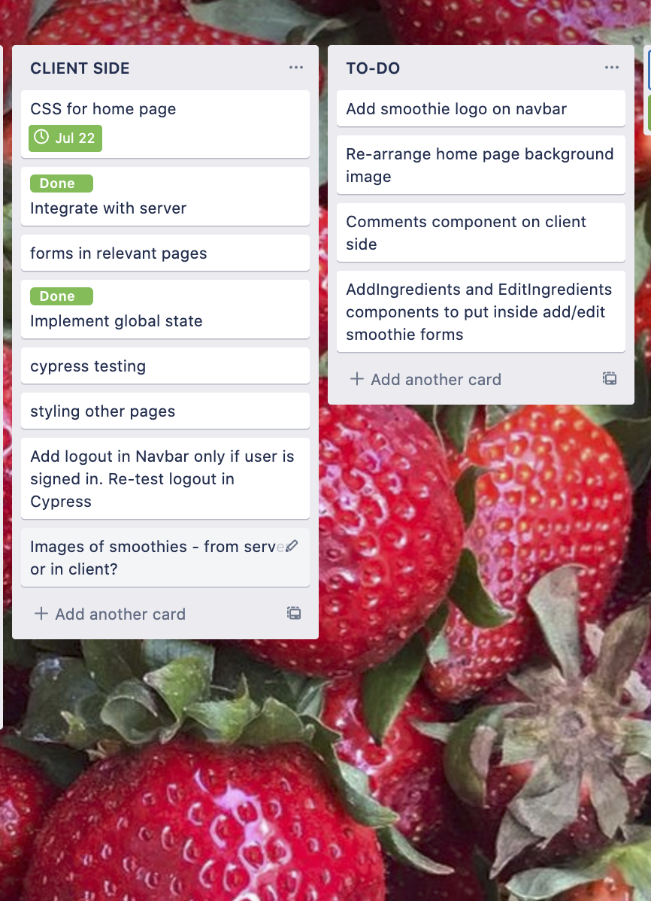
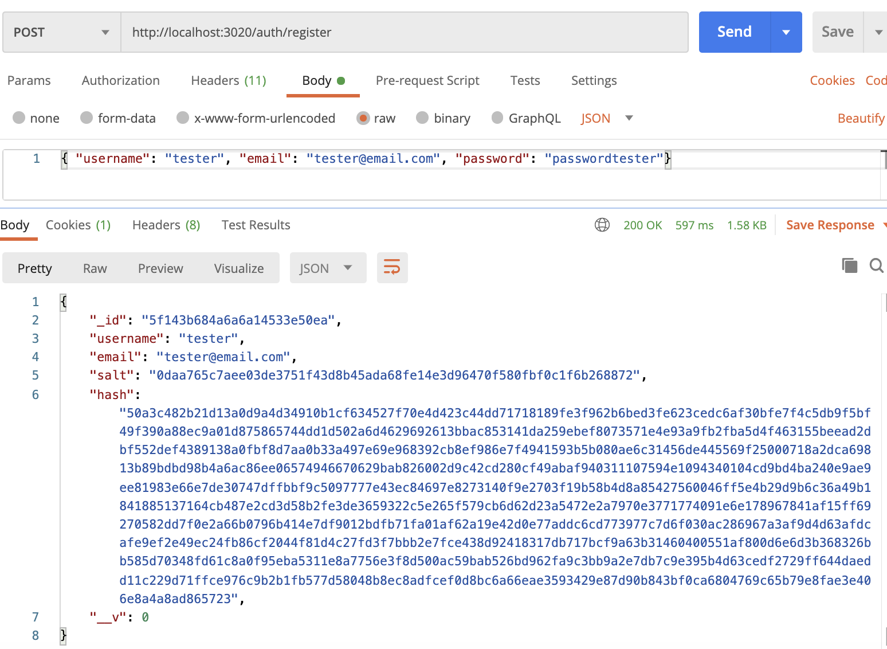

**SMOOTHIVERSE APP**
***Done by Aubrey, Sumaya and Aishwarya.***
 

**R11. A link (URL) to your deployed website**
- SERVER: https://smoothiverse-server.herokuapp.com/
- CLIENT: https://smoothiverse.netlify.app/

 

**R12. A link to your GitHub repository (repo)**
- https://github.com/femmestackers/server

- https://github.com/femmestackers/client

 

**R13.  The contents of your README.md as submitted for Full Stack App - Part A**

- https://github.com/femmestackers/docs

**R2. Employ and utilise proper source control methodology (git)**
We created a GitHub Organisation for our team inside which we made 3 repos - Client, Server and Docs. The workflow that we discussed to follow was the 'Feature branch workflow'. Each team member works on a feature in their own feature branch - by staging, committing and pushing changes to the feature branch(not the master) in the process. When the feature is ready, before merging to master, a pull request is sent to other team members to review the work done on the feature branch, or incase of any errors/need of discussion. After review, either suggested changes are made(and pull request process is repeated) or the feature branch is merged to the master. Every team member took care to pull the latest version by doing a ‘git pull origin master’ before starting work on a new feature branch.

**R3. Use a recognised project management methodology**
- The link for our Trello board: https://trello.com/b/CJdS4MDn/smoothiverse

We decided to use Trello for Project management to keep in line with the Agile methodology where we put up lists and made cards for tasks. We decided to assign members to specific tasks and wrote down deadline dates. We had cards to write down what we worked on in the span of our 3 class days. We also made ’to-do’ cards for the next 3 day period. The tasks were marked appropriately on the basis of whether they were 'to-do', 'doing', or 'done'. Since we were following Agile, we also had daily standups before 10am where each one of us would take turns in giving a brief about the work done ‘yesterday’, what’s planned for ’today’ and ’tomorrow’, along with the obstacles faced in the process. This would keep the team updated on how the project is shaping up, and would give each member a sense of responsibility towards their task(and towards their contribution to the project as a whole).

 Our trello board which we used for delegating tasks and managing them.

 

**R4. Use a recognised task delegation methodology**
We delegated tasks among team members on a daily basis. We had daily meetings at 7pm every night to check up on the progress, how each of us was doing and helped each other by giving feedback, reviewing the other's work and fixing problems. The tasks where we worked together was all co-authored on GitHub.
 

**R5. Produce a working application that meets user needs**
 It allows the users to view smoothie recipes and allows them to filter smoothies from their favourite categories. It also allows users to post their recipes for others to see. There is authentication with passport that allows only registered/loggedin users to access the smoothies. Authorisation is implemented by way of having users who can only edit and delete their own posts. We also implemented a filter where users can search smoothies by category .
 We also wanted to have users comments on smoothies on the client side. We do have the comments controller and tested for commnents on the server side. But unfortunately, we couldnt implement it on the client side due to lack of time. Our next step in building this app would be to have an API for Smoothie images and for users to store their uploaded images on Amazon S3

 **R6.  Deploy the application to a cloud hosting service**
 Our server side was deployed to Heroku and client side on Netlify, both of them through pushing our code on GitHub.
 We also used MongoDB Atlas to deploy our seeded smoothies and Users data.

**R8. Provides evidence of user testing**:
***1. In the development environment***
We tested using client.http and Postman. We have included screenshots of both passed and failed tests and have documented in the spreadsheet the reason why it was failing and how we corrected it. 

- Development Testing Spreadsheet 
 
Screenshots for test done in Client.http and Postman
 
- Register a new user 
- Login user 
- Get all smoothies 
- Get smoothie by Id 
- Update smoothie 
- Failed-to-add-comment 
- Post a comment on smoothie 
- Delete comment by Id 
- Get smoothie by Id and its comments 
- Failed to add new smoothie
- Added new smoothie 
- deleted smoothie
- Permission error to delete smoothie
- Logout user 

MOCHA TEST RESULTS SCREENSHOTS

- Incorrect smoothie by id 

- Name undefined 

- Condition Error 

- Unmatched Smoothie name 

- All test passing 

 

***2. In the production environment***

- Production Testing Spreadsheet 
 

- Register user 
- Login user  
- Logout user 
- Adding smoothie 
- Delete smoothie 

**R9. Utilises a formal testing framework**
Our cypress screenshots:
 The tests which failed are also included and then we rectified it and have included the passing test screenshots

 
